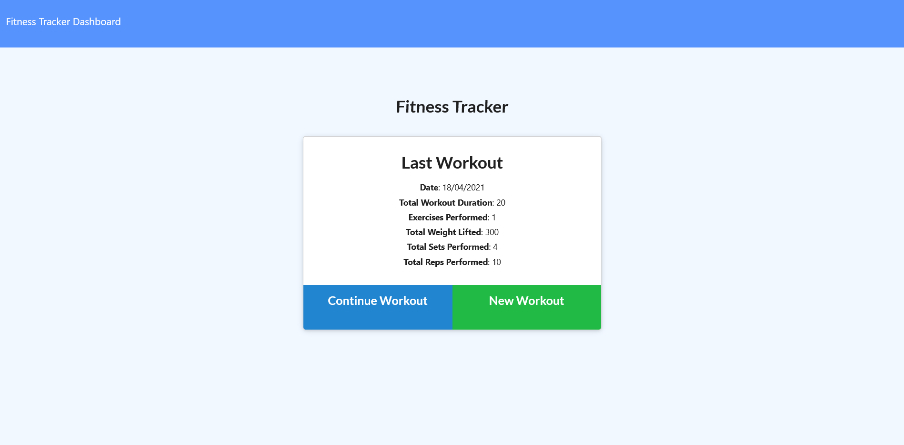
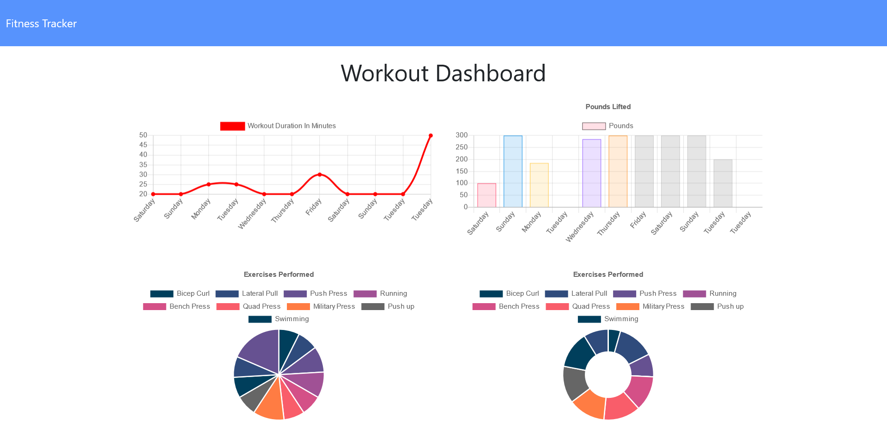
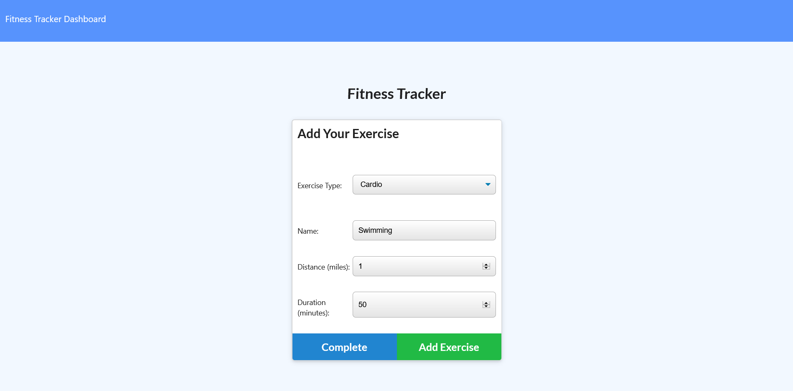
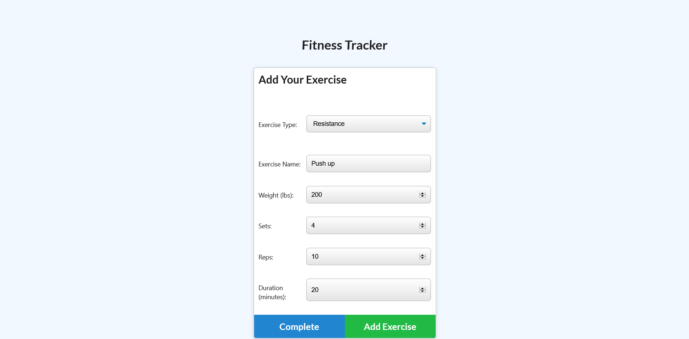

  # Title
  ## Fitness-Tracker
  
  
  
  ## Table of contents 
  - [Description](#description)
  - [Installation](#installation)
  - [Usage Information](#usage-information)
  - [License](#license)
  - [Contribution Guidelines](#contribution-guidelines)
  - [Test Procedure](#test-procedure)
  - [Screenshot](#screenshot)
  - [deployed](#deployed)
  - [Questions](#questions)
  
  ## Description
     This application built on nodejs, express, and mongoose. This application structure follows the Model-View-Controller pattern where controller as routes, and mongoose is used. Overall, this Keep track of all user's types of exercise performed including cardio and resistance. 
     user can add new exercise with new workout or keep update existing workout by adding new exercises.     

  ## Installation
     first need to clone from given github link and need to perform 'npm i' on terminal within the project location. 
     Second, type on terminal 'npm run seed' to get test for application if not then you can put your own data or 
     use application to create data.
     Third, 'npm run seed' to insert the dummy data useful to check application 
     fourth, 'node server.js' or 'npm start' to run the actual application. 
     Finally, the application will run and allows blogging.

  ## Usage Information
     It is useful to track the exercises of user, and allows user to observe the total duration of exercises done. 
     User can observe outputs in different graphs including line, bar chart, and pie charts with donut chart

  ## License
     MIT license
  
  ## Contribution Guidelines
     N/A

  ## Test Procedure
     N/A
  
  ## Screenshot
  ### welcome Screen
  

  ### dashboard 
  
  
  ### cardio page
  

  ### resistance page
    

  ## deployed
  
  
  ## Questions
    if you have questions then please feel free to contact on these addresses,
  
  Github: [SthaSub](https://github.com/SthaSub)
  
  Email: [subhashshrestha3@gmail.com](subhashshrestha3@gmail.com)
    